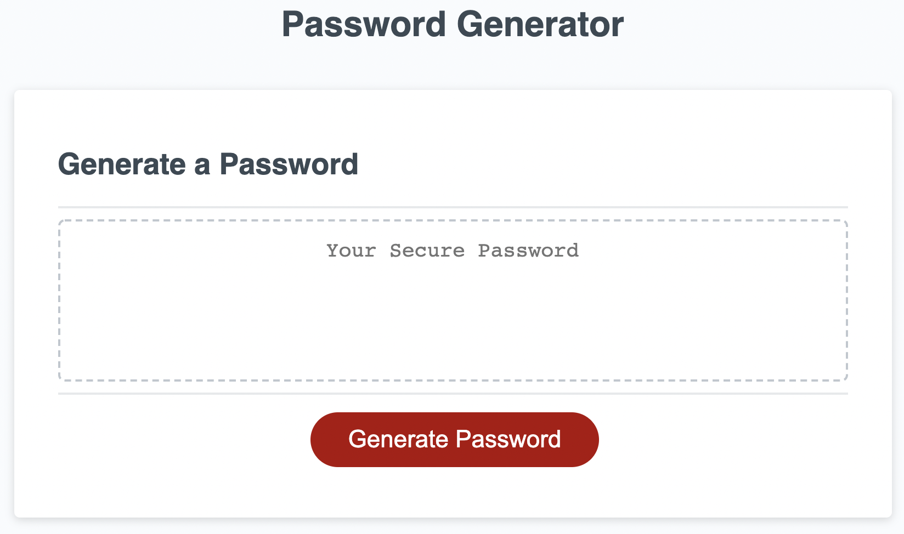
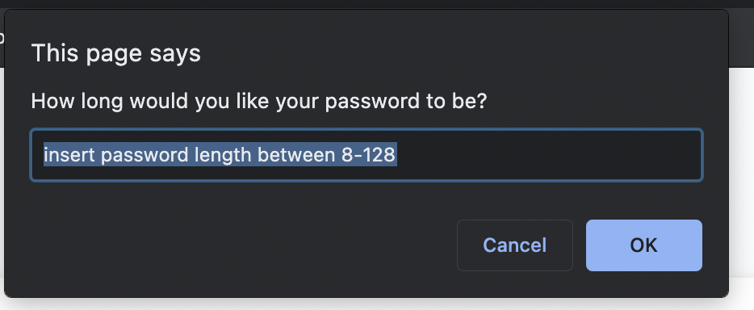

# Password Generator

This site will generate a password according to the following user-input parameters:
```bash
- Password Length between 8 and 128 characters
- Whether the password will include uppercase letters.
- Whether the password will include lowercase letters.
- Whether the password will include numbers.
- Whether the password will include special characters.
```

## Initial User Interface

The password parameters are determined by a series of prompts that occur after pressing the "Generate Password" button seen below:



## User Interaction

User feedback is collected through the following prompts:

To specify password length:




## Author

Asher Bergtraun